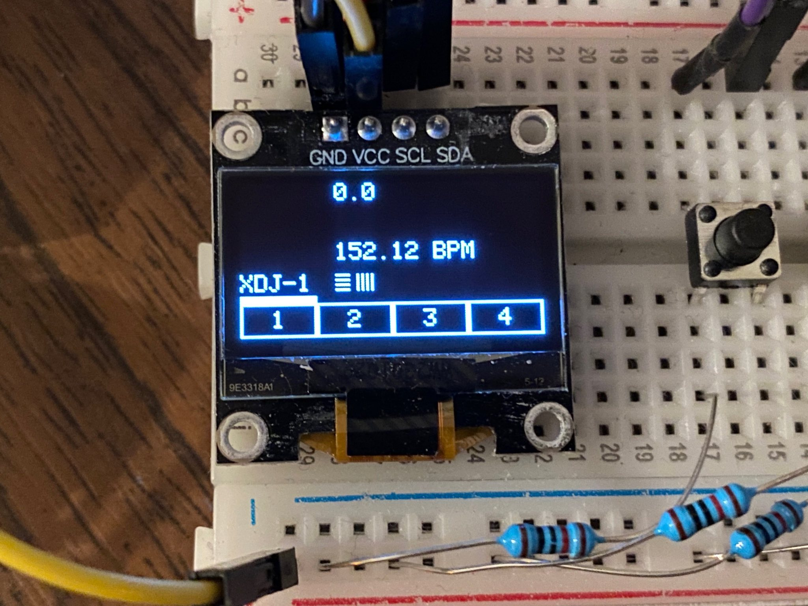

# java-BC
* Software (main): [java-BC](https://github.com/kokospalme/java-BC)
* Software (gui): [obcgui](https://github.com/kokospalme/obcgui/)
* Hardware (pcb): [KiCad_obcgui](https://github.com/kokospalme/KiCad_obcbox)
* Hardware (case): [grabcad](https://grabcad.com/library/obcbox-enclosure-v1-0-1)

## orign
[](https://deep-symmetry.zulipchat.com/#narrow/stream/278354-carabiner)
A java progam to make open-beat-control work on a handy single-board-computer for livegigs etc. This project is based on [Deep-Symmetry's great java-beat-control-example](https://github.com/Deep-Symmetry/java-beat-control-example) and currently in progress. So please be careful when you fork it!

## Used libraries
Libraries that are used in this project:
* https://github.com/fauxpark/oled-core
* https://github.com/Deep-Symmetry/java-beat-control-example

# Hardware
In the future there will be a small pcb which can be stacked onto the pi, but for now I'm using:
<a href=""></a>
* raspberry pi 3B+
* OLED Display SSD1306
* a couple of tactile switches + 10kΩ-pullup resistors
* a breadboard
Tested gear:
* Pioneer XDJ-1000MK2
* Akai Force
* Ableton Live lite 11 (mac)


# Software
## functionality
* [x] establish a connection between DJ Pro Link and Ableton Link
* [X] display player 1...4 with names and where the Ableton Session is 
* [X] display current BPM
* [ ] display [barphase](https://github.com/kokospalme/java-BC/blob/main/doc/BarphaseAbleton.mov) with a bar (like in Ableton Live)
* [X] display the current latency between DJ Pro Link and Ableton Link
* [X] manipulate latency on the fly via buttons
* [X] manipulate who is the current Master of the session
* [] illuminate an LED when Ableton Link is Master (bugs when obcgui is used in java-BC)

## install
* install raspberry pi OS lite on a SD card with the [Raspberry Pi imager](https://www.raspberrypi.com/software/)
* setup SSH and your home WiFi before installing to get access to the pi with your computer
* download [Cyberduck](https://cyberduck.io/) or another program to upload the java program to the pi
* make the pi ready for Java and I2C communication and GPIO stuff with:
* update pi: ```sudo apt update``` & ```sudo apt full-upgrade```
* install I2C-Tools: ```sudo apt-get install i2c-tools```
* activate I2C with: ```raspi-config```
* scan I2C if there is the display: ```i2cdetect -y 1```
* install java: ```sudo apt install default-jre```
* you can check the java-version with: ```java -version ```
* install pigpio with ```sudo apt-get install pigpio```(see [this page](https://stackoverflow.com/questions/29721389/pi4j-unable-to-load-libpi4j-so-using-path))
* upload the .jar file to ```/home/pi/``` with cyberduck
* run the application with: ```sudo java -jar /home/pi/java-BC.jar```

## Start program with boot
* access the pi with the terminal(mac): ```ssh pi@ip.address.of.the.pi```
* type in the password ("raspberry" on raspberry pi OS)
* cmd:```sudo nano /etc/rc.local```will open a file in which you can write commands that are executed with booting
* add the line: ```sudo java -jar /home/pi/java-BC.jar -r -B -l=-17``` to the file and save it
* cmd: ```sudo reboot```will 


Distributed under the [Eclipse Public License
2.0](https://opensource.org/licenses/EPL-2.0). By using this software
in any fashion, you are agreeing to be bound by the terms of this
license. You must not remove this notice, or any other, from this
software. A copy of the license can be found in
[LICENSE.md](https://github.com/Deep-Symmetry/beat-carabiner/blob/master/LICENSE.md)
within this project.
